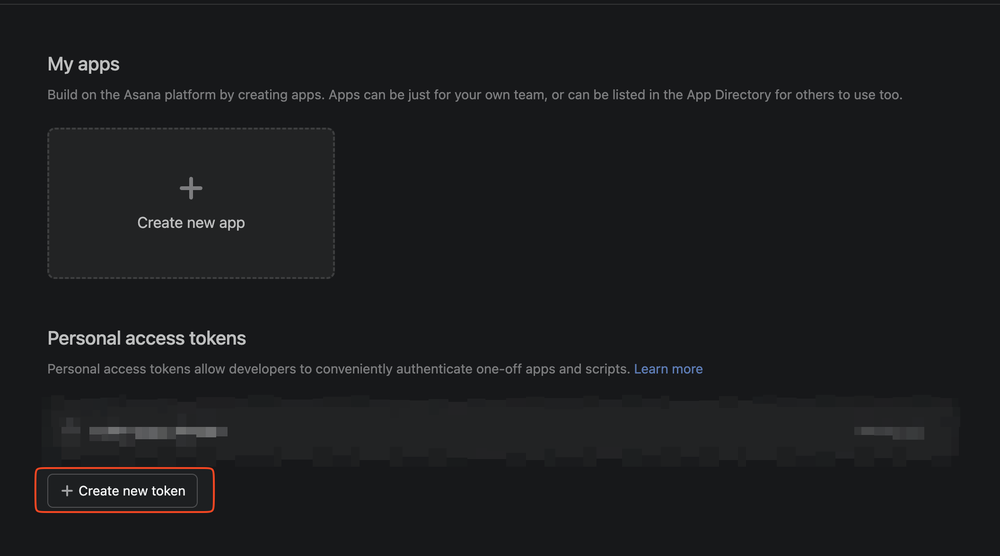

# Asana Tools

Asana API を操作するシェルスクリプトツールキット。

## 導入方法

### 1. 依存パッケージのインストール

```bash
cd ~/Desktop/asana-tools
bun install
```

### 2. Personal Access Token (PAT) の発行

1. https://app.asana.com/0/developer-console にアクセス
2. 「Personal access tokens」セクションで「+ Create new token」をクリック
3. トークン名を入力（例: `cli-tools`）して作成
4. 表示されたトークンをコピー（一度しか表示されない）



### 3. 環境変数の設定

```bash
cp .env.example .env
```

`.env` を編集して `ASANA_PAT` にコピーしたトークンを貼り付ける:

```bash
ASANA_PAT=1/1234567890:abcdef...
```

### 4. 動作確認

```bash
./scripts/get-me.sh
```

自分のユーザー情報（gid, name, email）が表示されれば成功。

### 5. デフォルト値の設定（オプション）

よく使うワークスペースやプロジェクトの GID を `.env` に設定しておくと、スクリプト実行時に引数を省略できる:

```bash
# ワークスペース GID を確認
./scripts/list-workspaces.sh

# プロジェクト GID を確認
./scripts/list-projects.sh <workspace_gid>
```

確認した値を `.env` に設定:

```bash
ASANA_WORKSPACE_GID=1234567890
ASANA_PROJECT_GID=1234567890
ASANA_ASSIGNEE_GID=1234567890  # 自分の gid（get-me.sh で確認）
```

## 前提条件

- [bun](https://bun.sh/) または npm
- `jq`（JSON整形）
- `curl`
